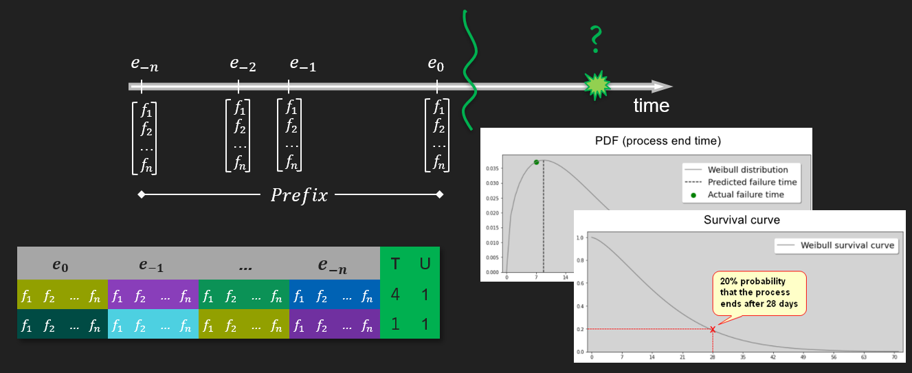

# Predicting Remaining Cycle Time from Ongoing Case

Predicting the remaining cycle time of ongoing cases is one important use case of predictive process monitoring. 
It is machine learning approach based on survival analysis that can learn from complete/ongoing traces.  
we train a neural network to predict the probability density function of the remaining cycle time of a running case. 

# Documentation:

https://fazaki.github.io/cycle_prediction/

# Getting started:

## A) pip installation

#### 1. Cd to home dir
    cd ~

#### 2. Initialize a virtualenv that uses the Python 3.7 available at home directory
    virtualenv -p ~/python-3.7/bin/python3 PROJECTNAME

#### 3. Activate the virtualenv

Windows:

	source ~/PROJECTNAME/Scripts/activate
	
Linux:

	source ~/PROJECTNAME/bin/activate

#### 4. Install below packages
    pip install cycle-prediction
    
#### 5. Create a new kernel with the same project name
    pip install -U pip ipykernel
    ipython kernel install --user --name=PROJECTNAME

#### 6. Use the example notebook

## B) Source code installation:

#### 1. Cd to home dir
    cd ~

#### 2. Initialize a virtualenv that uses the Python 3.7 available at home directory
	Virtualenv -p ~/python-3.7/bin/python3 PROJECTNAME

#### 3. Activate the virtualenv

Windows:

	source ~/PROJECTNAME/Scripts/activate
	
Linux:

	source ~/PROJECTNAME/bin/activate

#### 4. Install ipykernel
    pip install -U pip ipykernel

#### 5.  Clone the repo
    git clone https://github.com/fazaki/time-to-event/tree/master
    cd time-to-event

#### 6.  Install required dependencies: 
    pip install -e .

#### 7.  Use the example notebook

# Theory
- Paper publication in progress

# References

- https://arxiv.org/abs/1612.02130
- https://ragulpr.github.io/assets/draft_master_thesis_martinsson_egil_wtte_rnn_2016.pdf
- https://verenich.github.io/ProcessSequencePrediction/
- https://github.com/ragulpr/wtte-rnn